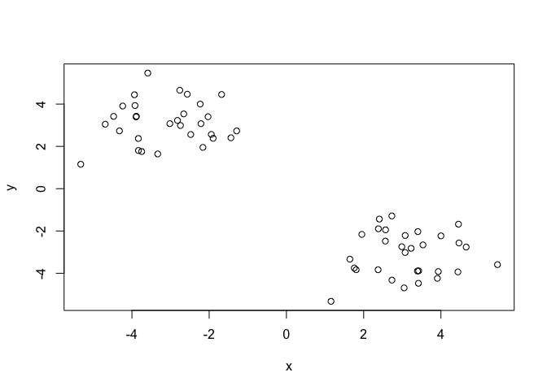

# Intro to Machine Learning 1
Karina Cardenas, A16742606
2025-04-22

- [Intro to Machine learning](#intro-to-machine-learning)
- [Clustering](#clustering)
  - [K-means](#k-means)
  - [Heirarchical Clustering](#heirarchical-clustering)
- [Principal component Analysis
  (PCA)](#principal-component-analysis-pca)
  - [barplot 1](#barplot-1)
  - [barplot 2](#barplot-2)
  - [Paris plot](#paris-plot)
  - [PCA to the Rescue](#pca-to-the-rescue)

## Intro to Machine learning

There are different types of machine learning, a few notable mentions:

- **Unsupervised learning**: Finding structure in unlabeled data

- **Supervised learning**: Making predictions based on labeled data i.e
  regression/classification

- **Reinforcement learning**: Making decisions based on past experiences

Today we will explore **unsupervised machine learning** methods starting
with clustering and dimensionality reduction.

## Clustering

To start let’s make up some data to cluster where we know what the
answer should be. The `rnorm()` function will help us here

``` r
hist(rnorm(10000, mean = 3))
```


Return 30 numbers centered on -3

``` r
tmp <- c(rnorm(30, mean =-3),
rnorm(30, mean =+3))

x <- cbind(x = tmp, y = rev(tmp)) 

x
```

                  x         y
     [1,] -3.892251  3.393118
     [2,] -1.287929  2.730060
     [3,] -2.743745  2.987390
     [4,] -1.945311  2.566093
     [5,] -2.029503  3.402924
     [6,] -2.820941  3.228189
     [7,] -3.919967  3.931489
     [8,] -2.566742  4.466561
     [9,] -2.476761  2.561012
    [10,] -3.833353  2.373773
    [11,] -3.332269  1.642700
    [12,] -5.325078  1.154384
    [13,] -1.678152  4.454143
    [14,] -3.018243  3.073666
    [15,] -4.322749  2.731757
    [16,] -1.436996  2.405699
    [17,] -2.161182  1.952432
    [18,] -4.691457  3.048103
    [19,] -1.896873  2.381318
    [20,] -2.211875  3.074931
    [21,] -3.747515  1.757607
    [22,] -4.239272  3.908076
    [23,] -4.473793  3.417154
    [24,] -2.760548  4.653975
    [25,] -2.231458  4.000896
    [26,] -3.885762  3.423956
    [27,] -2.658673  3.535183
    [28,] -3.831906  1.806188
    [29,] -3.934494  4.440325
    [30,] -3.589710  5.465098
    [31,]  5.465098 -3.589710
    [32,]  4.440325 -3.934494
    [33,]  1.806188 -3.831906
    [34,]  3.535183 -2.658673
    [35,]  3.423956 -3.885762
    [36,]  4.000896 -2.231458
    [37,]  4.653975 -2.760548
    [38,]  3.417154 -4.473793
    [39,]  3.908076 -4.239272
    [40,]  1.757607 -3.747515
    [41,]  3.074931 -2.211875
    [42,]  2.381318 -1.896873
    [43,]  3.048103 -4.691457
    [44,]  1.952432 -2.161182
    [45,]  2.405699 -1.436996
    [46,]  2.731757 -4.322749
    [47,]  3.073666 -3.018243
    [48,]  4.454143 -1.678152
    [49,]  1.154384 -5.325078
    [50,]  1.642700 -3.332269
    [51,]  2.373773 -3.833353
    [52,]  2.561012 -2.476761
    [53,]  4.466561 -2.566742
    [54,]  3.931489 -3.919967
    [55,]  3.228189 -2.820941
    [56,]  3.402924 -2.029503
    [57,]  2.566093 -1.945311
    [58,]  2.987390 -2.743745
    [59,]  2.730060 -1.287929
    [60,]  3.393118 -3.892251

Make a plot of X

``` r
plot(x)
```



### K-means

The main function in “base” R for K-means clustering is called
`kmeans()`:

``` r
#x = x
#centers = 2, # of groups 

km <- kmeans(x, centers = 2 )
km
```

    K-means clustering with 2 clusters of sizes 30, 30

    Cluster means:
              x         y
    1  3.132273 -3.098150
    2 -3.098150  3.132273

    Clustering vector:
     [1] 2 2 2 2 2 2 2 2 2 2 2 2 2 2 2 2 2 2 2 2 2 2 2 2 2 2 2 2 2 2 1 1 1 1 1 1 1 1
    [39] 1 1 1 1 1 1 1 1 1 1 1 1 1 1 1 1 1 1 1 1 1 1

    Within cluster sum of squares by cluster:
    [1] 61.49337 61.49337
     (between_SS / total_SS =  90.4 %)

    Available components:

    [1] "cluster"      "centers"      "totss"        "withinss"     "tot.withinss"
    [6] "betweenss"    "size"         "iter"         "ifault"      

the `kmeans()` function returns a “list” with 9 components. You can see
the named components of any list with the `attributes` function

``` r
attributes(km)
```

    $names
    [1] "cluster"      "centers"      "totss"        "withinss"     "tot.withinss"
    [6] "betweenss"    "size"         "iter"         "ifault"      

    $class
    [1] "kmeans"

> Q. How many points are in each cluster?

``` r
km$size
```

    [1] 30 30

> Q. How do we get the cluster membership assignment?

``` r
km$cluster
```

     [1] 2 2 2 2 2 2 2 2 2 2 2 2 2 2 2 2 2 2 2 2 2 2 2 2 2 2 2 2 2 2 1 1 1 1 1 1 1 1
    [39] 1 1 1 1 1 1 1 1 1 1 1 1 1 1 1 1 1 1 1 1 1 1

> Q. Cluster centers?

``` r
km$centers
```

              x         y
    1  3.132273 -3.098150
    2 -3.098150  3.132273

> Q. Make a plot of our `kmeans()` results showing cluster assignment
> using different colors for each cluster/group of points and cluster
> centers?

``` r
#different colors for each cluster/group 
plot(x, col = km$cluster)

#cluster centers: col = color, pch = shape, cex = character size 
points(km$centers, col = "blue", pch = 15, cex = 2)
```


> Q. Run `kmeans()` again on `x` and this time cluster it into 4
> groups/clusters and plot the same result figure as above.

``` r
km4 <- kmeans(x, centers = 4 )
km4
```

    K-means clustering with 4 clusters of sizes 16, 14, 17, 13

    Cluster means:
              x         y
    1 -2.756218  2.443648
    2 -3.488931  3.919274
    3  3.349386 -2.324391
    4  2.848356 -4.109990

    Clustering vector:
     [1] 2 1 1 1 1 1 2 2 1 1 1 1 2 1 2 1 1 2 1 1 1 2 2 2 2 2 2 1 2 2 3 4 4 3 4 3 3 4
    [39] 4 4 3 3 4 3 3 4 3 3 4 4 4 3 3 4 3 3 3 3 3 4

    Within cluster sum of squares by cluster:
    [1] 23.02256 18.20373 20.43304 15.72345
     (between_SS / total_SS =  94.0 %)

    Available components:

    [1] "cluster"      "centers"      "totss"        "withinss"     "tot.withinss"
    [6] "betweenss"    "size"         "iter"         "ifault"      

``` r
plot(x, col = km4$cluster, )
points(km4$centers, col = "blue", pch = 15, cex = 1)
```


> **keypoint**: K -means clustering is super popular but can be misused.
> one big limitarion is that it can impose a clustering pattern on your
> data even if clear natural groupiing doesn’t exist - i.e it does what
> you tell it to do in terms of `centers`

### Heirarchical Clustering

The main function in “base” R for hierarchical clustering is called
`hclust()`.

You can’t just pass our input dataset as is into `hclust()` as we did
with `kmeans()`. You must give “distance matrix” as input. We can get
this from the `dist()` function in R.

``` r
#calculating distance matrix 
d <- dist(x)

#clustering d/x
hc <- hclust(d)

#printing hc 
hc
```


    Call:
    hclust(d = d)

    Cluster method   : complete 
    Distance         : euclidean 
    Number of objects: 60 

The results of `hclust()` dont have a useful `print()` method but do
have a special `plot()` method.

``` r
#x = hc 
plot(hc)

#adds a horizontal line to cut the tree
abline(h = 8, col = "red")
```


To get out main cluster assignment ( membership vector ), we need to
“cut” the tree at the big line.

``` r
#cutree = function, hc = plot/data, h = height at cutting 
grps <- cutree(hc, h = 8)
grps
```

     [1] 1 1 1 1 1 1 1 1 1 1 1 1 1 1 1 1 1 1 1 1 1 1 1 1 1 1 1 1 1 1 2 2 2 2 2 2 2 2
    [39] 2 2 2 2 2 2 2 2 2 2 2 2 2 2 2 2 2 2 2 2 2 2

``` r
#table function
table(grps)
```

    grps
     1  2 
    30 30 

``` r
#plotting x, with hc grps 
plot(x, col = grps)
```


Hierarchical Clustering is distinct in that the dendrogram (tree figure)
can reveal the potential grouping in your data (unlike k-means).

## Principal component Analysis (PCA)

PCA is a common and highly useful dimensionality reduction technique
used in many fields - particularly bioinformatics.

Here we will analyze some data from the UK on food consumption.

``` r
#Reading csv file 
url <- "https://tinyurl.com/UK-foods"
x <- read.csv(url)

head(x)
```

                   X England Wales Scotland N.Ireland
    1         Cheese     105   103      103        66
    2  Carcass_meat      245   227      242       267
    3    Other_meat      685   803      750       586
    4           Fish     147   160      122        93
    5 Fats_and_oils      193   235      184       209
    6         Sugars     156   175      147       139

we need to change the first column to be the names of the foods and not
numbered. There are several ways to do so, but this way is inefficient
and destructive.

``` r
rownames(x) <- x[,1]

#overwriting x by removing a column everytime it is ran 
x <- x[,-1]

head(x)
```

                   England Wales Scotland N.Ireland
    Cheese             105   103      103        66
    Carcass_meat       245   227      242       267
    Other_meat         685   803      750       586
    Fish               147   160      122        93
    Fats_and_oils      193   235      184       209
    Sugars             156   175      147       139

However, this way changes the row names of the first column without
removing the country columns.

``` r
x <- read.csv(url, row.names = 1)
head(x)
```

                   England Wales Scotland N.Ireland
    Cheese             105   103      103        66
    Carcass_meat       245   227      242       267
    Other_meat         685   803      750       586
    Fish               147   160      122        93
    Fats_and_oils      193   235      184       209
    Sugars             156   175      147       139

### barplot 1

``` r
barplot(as.matrix(x), beside=T, col=rainbow(nrow(x)))
```


### barplot 2

``` r
barplot(as.matrix(x), beside=F, col=rainbow(nrow(x)))
```


### Paris plot

One conventional plot that can be useful is called a “paris” plot.

``` r
#paris = type of plot, x = data, col = color, pch = style of marker 
pairs(x, col=rainbow(10), pch=16)
```


### PCA to the Rescue

The main function in base R for PCA is called `prcomp()`.

``` r
#t = transpose, make the countries be the rows and cheese be the columns 
t(x)
```

              Cheese Carcass_meat  Other_meat  Fish Fats_and_oils  Sugars
    England      105           245         685  147            193    156
    Wales        103           227         803  160            235    175
    Scotland     103           242         750  122            184    147
    N.Ireland     66           267         586   93            209    139
              Fresh_potatoes  Fresh_Veg  Other_Veg  Processed_potatoes 
    England               720        253        488                 198
    Wales                 874        265        570                 203
    Scotland              566        171        418                 220
    N.Ireland            1033        143        355                 187
              Processed_Veg  Fresh_fruit  Cereals  Beverages Soft_drinks 
    England              360         1102     1472        57         1374
    Wales                365         1137     1582        73         1256
    Scotland             337          957     1462        53         1572
    N.Ireland            334          674     1494        47         1506
              Alcoholic_drinks  Confectionery 
    England                 375             54
    Wales                   475             64
    Scotland                458             62
    N.Ireland               135             41

``` r
#pca = anlaysis 
pca <- prcomp(t(x))

#overview of pca results 
summary(pca)
```

    Importance of components:
                                PC1      PC2      PC3       PC4
    Standard deviation     324.1502 212.7478 73.87622 2.921e-14
    Proportion of Variance   0.6744   0.2905  0.03503 0.000e+00
    Cumulative Proportion    0.6744   0.9650  1.00000 1.000e+00

The `prcomp` function returns a list object of our results with fivee
attributes/components

``` r
attributes(pca)
```

    $names
    [1] "sdev"     "rotation" "center"   "scale"    "x"       

    $class
    [1] "prcomp"

The two main “results” in here are `pca$x` and `pca$rotation`. The first
set of (`pcs$x`) contains the scores of the data on the new PC acis - we
use these to make our PCA plot.

``` r
pca$x
```

                     PC1         PC2        PC3           PC4
    England   -144.99315   -2.532999 105.768945 -9.152022e-15
    Wales     -240.52915 -224.646925 -56.475555  5.560040e-13
    Scotland   -91.86934  286.081786 -44.415495 -6.638419e-13
    N.Ireland  477.39164  -58.901862  -4.877895  1.329771e-13

``` r
library(ggplot2)
library(ggrepel)

ggplot(pca$x) + 
    aes(PC1, PC2, label = rownames(pca$x)) + 
    geom_point() + 
    geom_text_repel()
```


The plot utilizes **PCA** to display the similarities that are observed
within scotland, England and wales using summarized components. Within
this plot, N.Ireland is observed as an outleir, but fails to specify
what food category creates this disparity.

The second major result is contained in the `pca$rotation`
object/component

``` r
ggplot(pca$rotation) + 
  aes(PC1, rownames(pca$rotation)) +
  geom_col() + 
  labs(title = "PCA", x = "PC1", y = "Food types")
```


Tells us how the original variables contribute to PCA. Anything to the
right side of the plot (positive values) is what abundantly consumed in
Ireland. It visually displays the differences of Ireland previously not
visible with just the data.
