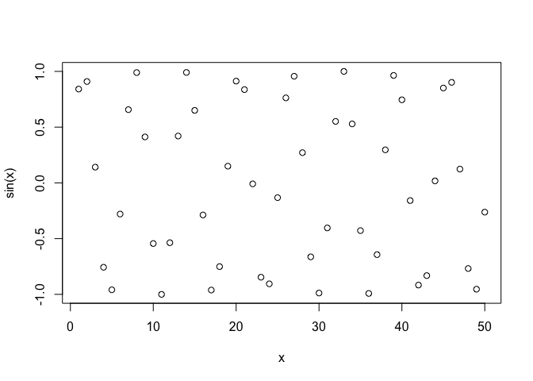
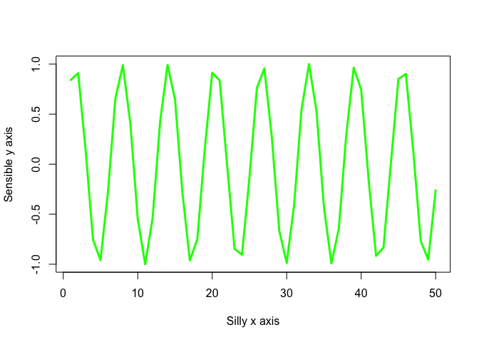

# Intro to R
Karina Cardenas PID: A16742606
Invalid Date

``` r
# My first R script
x <- 1:50

plot(x, sin(x))
```



``` r
plot(x, sin(x), typ = "l", col = "green", lwd = 3, xlab = "Silly x axis", 
     ylab = "Sensible y axis")
```



``` r
#typ = type, col = color, lwd = line width, x and ylab = axis names
```
