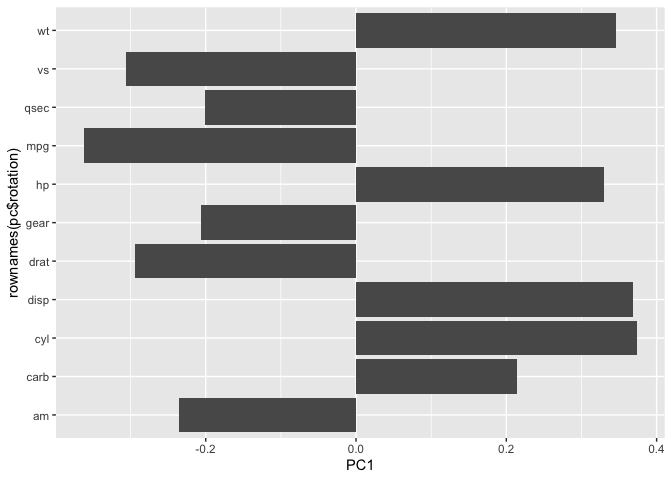

# lab08_backup
Karina Cardenas

- [Background](#background)
- [Data Import](#data-import)
  - [Cleaning the Data](#cleaning-the-data)
- [Clustering](#clustering)
- [Principal Component Analysis
  (PCA)](#principal-component-analysis-pca)
  - [The Importance of scaling](#the-importance-of-scaling)
  - [Scaling the Wisconsin data](#scaling-the-wisconsin-data)
  - [Wisconsin PCA plots](#wisconsin-pca-plots)
- [Combining methods](#combining-methods)
  - [Clustering on PCA results](#clustering-on-pca-results)
- [Prediction](#prediction)

## Background

The goal of this mini-project is for you to explore a complete analysis
using the unsupervised learning techniques covered in class. You’ll
extend what you’ve learned by combining PCA as a preprocessing step to
clustering using data that consist of measurements of cell nuclei of
human breast masses. This expands on our RNA-Seq analysis from last day.

The mini project explores unsupervised learning techniques covered in
class. interpreting principal component analysis (PCA) to reduce the
dimensional of the data while retaining variance, and applying
hierarchical clustering with different linkage methods. It also includes
an optional section on K-means clustering for comparison. The ultimate
goal is to combine PCA and clustering to better separate benign and
malignant cell samples evaluating the results using metrics like
sensitivity and specificity and finally demonstrating how to predict he
classification of new samples using the developed PCA model.

## Data Import

Our data comes from the University of Wisconsin Medical Center. Omit the
ID column from the dataset.

``` r
# Save your input data file into your Project directory
fna.data <- "WisconsinCancer.csv"

# Complete the following code to input the data and store as wisc.df
wisc.df <- read.csv(fna.data, row.names=1)

head(wisc.df)
```

             diagnosis radius_mean texture_mean perimeter_mean area_mean
    842302           M       17.99        10.38         122.80    1001.0
    842517           M       20.57        17.77         132.90    1326.0
    84300903         M       19.69        21.25         130.00    1203.0
    84348301         M       11.42        20.38          77.58     386.1
    84358402         M       20.29        14.34         135.10    1297.0
    843786           M       12.45        15.70          82.57     477.1
             smoothness_mean compactness_mean concavity_mean concave.points_mean
    842302           0.11840          0.27760         0.3001             0.14710
    842517           0.08474          0.07864         0.0869             0.07017
    84300903         0.10960          0.15990         0.1974             0.12790
    84348301         0.14250          0.28390         0.2414             0.10520
    84358402         0.10030          0.13280         0.1980             0.10430
    843786           0.12780          0.17000         0.1578             0.08089
             symmetry_mean fractal_dimension_mean radius_se texture_se perimeter_se
    842302          0.2419                0.07871    1.0950     0.9053        8.589
    842517          0.1812                0.05667    0.5435     0.7339        3.398
    84300903        0.2069                0.05999    0.7456     0.7869        4.585
    84348301        0.2597                0.09744    0.4956     1.1560        3.445
    84358402        0.1809                0.05883    0.7572     0.7813        5.438
    843786          0.2087                0.07613    0.3345     0.8902        2.217
             area_se smoothness_se compactness_se concavity_se concave.points_se
    842302    153.40      0.006399        0.04904      0.05373           0.01587
    842517     74.08      0.005225        0.01308      0.01860           0.01340
    84300903   94.03      0.006150        0.04006      0.03832           0.02058
    84348301   27.23      0.009110        0.07458      0.05661           0.01867
    84358402   94.44      0.011490        0.02461      0.05688           0.01885
    843786     27.19      0.007510        0.03345      0.03672           0.01137
             symmetry_se fractal_dimension_se radius_worst texture_worst
    842302       0.03003             0.006193        25.38         17.33
    842517       0.01389             0.003532        24.99         23.41
    84300903     0.02250             0.004571        23.57         25.53
    84348301     0.05963             0.009208        14.91         26.50
    84358402     0.01756             0.005115        22.54         16.67
    843786       0.02165             0.005082        15.47         23.75
             perimeter_worst area_worst smoothness_worst compactness_worst
    842302            184.60     2019.0           0.1622            0.6656
    842517            158.80     1956.0           0.1238            0.1866
    84300903          152.50     1709.0           0.1444            0.4245
    84348301           98.87      567.7           0.2098            0.8663
    84358402          152.20     1575.0           0.1374            0.2050
    843786            103.40      741.6           0.1791            0.5249
             concavity_worst concave.points_worst symmetry_worst
    842302            0.7119               0.2654         0.4601
    842517            0.2416               0.1860         0.2750
    84300903          0.4504               0.2430         0.3613
    84348301          0.6869               0.2575         0.6638
    84358402          0.4000               0.1625         0.2364
    843786            0.5355               0.1741         0.3985
             fractal_dimension_worst
    842302                   0.11890
    842517                   0.08902
    84300903                 0.08758
    84348301                 0.17300
    84358402                 0.07678
    843786                   0.12440

> Q. How many patient/samples are in this dataset? `nrow()`

``` r
nrow(wisc.df)
```

    [1] 569

> Q. How many of the observations have a malignant diagnosis? `table()`

``` r
#summarizes the quantity of diagnosis by malignant or benign 
table(wisc.df$diagnosis)
```


      B   M 
    357 212 

``` r
#sums the number of malignant diagnosis 
sum(wisc.df$diagnosis == "M")
```

    [1] 212

> Q. How many variables/features in the data are suffixed with `_mean`?

``` r
#column names
colnames(wisc.df)
```

     [1] "diagnosis"               "radius_mean"            
     [3] "texture_mean"            "perimeter_mean"         
     [5] "area_mean"               "smoothness_mean"        
     [7] "compactness_mean"        "concavity_mean"         
     [9] "concave.points_mean"     "symmetry_mean"          
    [11] "fractal_dimension_mean"  "radius_se"              
    [13] "texture_se"              "perimeter_se"           
    [15] "area_se"                 "smoothness_se"          
    [17] "compactness_se"          "concavity_se"           
    [19] "concave.points_se"       "symmetry_se"            
    [21] "fractal_dimension_se"    "radius_worst"           
    [23] "texture_worst"           "perimeter_worst"        
    [25] "area_worst"              "smoothness_worst"       
    [27] "compactness_worst"       "concavity_worst"        
    [29] "concave.points_worst"    "symmetry_worst"         
    [31] "fractal_dimension_worst"

``` r
#dimensions
dim(wisc.df)
```

    [1] 569  31

``` r
#grep gives index of which columns contain mean
length(grep("mean",colnames(wisc.df)))
```

    [1] 10

### Cleaning the Data

There is a diangosis column that is the clincian conensus that I want to
exclude from any further analysis. We will come back later and comapre
our results to this, so omit the Diagnosis column.

``` r
# We can use -1 here to remove the first column
wisc.data <- wisc.df[,-1]

head(wisc.data)
```

             radius_mean texture_mean perimeter_mean area_mean smoothness_mean
    842302         17.99        10.38         122.80    1001.0         0.11840
    842517         20.57        17.77         132.90    1326.0         0.08474
    84300903       19.69        21.25         130.00    1203.0         0.10960
    84348301       11.42        20.38          77.58     386.1         0.14250
    84358402       20.29        14.34         135.10    1297.0         0.10030
    843786         12.45        15.70          82.57     477.1         0.12780
             compactness_mean concavity_mean concave.points_mean symmetry_mean
    842302            0.27760         0.3001             0.14710        0.2419
    842517            0.07864         0.0869             0.07017        0.1812
    84300903          0.15990         0.1974             0.12790        0.2069
    84348301          0.28390         0.2414             0.10520        0.2597
    84358402          0.13280         0.1980             0.10430        0.1809
    843786            0.17000         0.1578             0.08089        0.2087
             fractal_dimension_mean radius_se texture_se perimeter_se area_se
    842302                  0.07871    1.0950     0.9053        8.589  153.40
    842517                  0.05667    0.5435     0.7339        3.398   74.08
    84300903                0.05999    0.7456     0.7869        4.585   94.03
    84348301                0.09744    0.4956     1.1560        3.445   27.23
    84358402                0.05883    0.7572     0.7813        5.438   94.44
    843786                  0.07613    0.3345     0.8902        2.217   27.19
             smoothness_se compactness_se concavity_se concave.points_se
    842302        0.006399        0.04904      0.05373           0.01587
    842517        0.005225        0.01308      0.01860           0.01340
    84300903      0.006150        0.04006      0.03832           0.02058
    84348301      0.009110        0.07458      0.05661           0.01867
    84358402      0.011490        0.02461      0.05688           0.01885
    843786        0.007510        0.03345      0.03672           0.01137
             symmetry_se fractal_dimension_se radius_worst texture_worst
    842302       0.03003             0.006193        25.38         17.33
    842517       0.01389             0.003532        24.99         23.41
    84300903     0.02250             0.004571        23.57         25.53
    84348301     0.05963             0.009208        14.91         26.50
    84358402     0.01756             0.005115        22.54         16.67
    843786       0.02165             0.005082        15.47         23.75
             perimeter_worst area_worst smoothness_worst compactness_worst
    842302            184.60     2019.0           0.1622            0.6656
    842517            158.80     1956.0           0.1238            0.1866
    84300903          152.50     1709.0           0.1444            0.4245
    84348301           98.87      567.7           0.2098            0.8663
    84358402          152.20     1575.0           0.1374            0.2050
    843786            103.40      741.6           0.1791            0.5249
             concavity_worst concave.points_worst symmetry_worst
    842302            0.7119               0.2654         0.4601
    842517            0.2416               0.1860         0.2750
    84300903          0.4504               0.2430         0.3613
    84348301          0.6869               0.2575         0.6638
    84358402          0.4000               0.1625         0.2364
    843786            0.5355               0.1741         0.3985
             fractal_dimension_worst
    842302                   0.11890
    842517                   0.08902
    84300903                 0.08758
    84348301                 0.17300
    84358402                 0.07678
    843786                   0.12440

``` r
diagnosis <- as.factor(wisc.df$diagnosis)

head(diagnosis)
```

    [1] M M M M M M
    Levels: B M

## Clustering

Let’s try `hclust()`

``` r
hc <- hclust(dist(wisc.data))

plot(hc)
```


We can extract clusters from this rather poor dendrogram/tree with the
`cutree()`

``` r
grps <- cutree(hc, k = 2)
```

How many individuals in each cluster

``` r
table(grps)
```

    grps
      1   2 
    549  20 

We can generate a cross-table that compares our cluster `grps` vector

``` r
#tells 
table(diagnosis, grps)
```

             grps
    diagnosis   1   2
            B 357   0
            M 192  20

## Principal Component Analysis (PCA)

### The Importance of scaling

The main function for PCA in base R is `prcomp()` it has a default input
parameter of `scale = FALSE`.

``` r
#prcomp()
head(mtcars)
```

                       mpg cyl disp  hp drat    wt  qsec vs am gear carb
    Mazda RX4         21.0   6  160 110 3.90 2.620 16.46  0  1    4    4
    Mazda RX4 Wag     21.0   6  160 110 3.90 2.875 17.02  0  1    4    4
    Datsun 710        22.8   4  108  93 3.85 2.320 18.61  1  1    4    1
    Hornet 4 Drive    21.4   6  258 110 3.08 3.215 19.44  1  0    3    1
    Hornet Sportabout 18.7   8  360 175 3.15 3.440 17.02  0  0    3    2
    Valiant           18.1   6  225 105 2.76 3.460 20.22  1  0    3    1

We could do a PCA of this data as is and it could be misleading…

``` r
pc <- prcomp(mtcars)

biplot(pc)
```


Lets look at the mean values of each column and their standard deviation

``` r
colMeans(mtcars)
```

           mpg        cyl       disp         hp       drat         wt       qsec 
     20.090625   6.187500 230.721875 146.687500   3.596563   3.217250  17.848750 
            vs         am       gear       carb 
      0.437500   0.406250   3.687500   2.812500 

``` r
apply(mtcars, 2, sd)
```

            mpg         cyl        disp          hp        drat          wt 
      6.0269481   1.7859216 123.9386938  68.5628685   0.5346787   0.9784574 
           qsec          vs          am        gear        carb 
      1.7869432   0.5040161   0.4989909   0.7378041   1.6152000 

We can “scale” this data data before PCA to get a much better
representation and analysis of all the columns.

``` r
mtscale <- scale(mtcars)
```

``` r
round(colMeans(mtscale))
```

     mpg  cyl disp   hp drat   wt qsec   vs   am gear carb 
       0    0    0    0    0    0    0    0    0    0    0 

``` r
apply(mtscale, 2, sd)
```

     mpg  cyl disp   hp drat   wt qsec   vs   am gear carb 
       1    1    1    1    1    1    1    1    1    1    1 

``` r
pc.scale <- prcomp(mtscale)
```

We can look at the two main results figures from PCA - the “PC plot” aka
(score plot, ordienation plot, or PC1 vs PC2 plot). The “loadings plot”
how the original variables contribute to the new PCs

``` r
library(ggplot2)

ggplot(pc.scale$rotation) + 
       aes(PC2, rownames(pc$rotation)) + 
      geom_col()
```


``` r
ggplot(pc.scale$rotation) + 
  aes(PC1, rownames(pc$rotation)) + 
  geom_col()
```



PC plot of scaled PCA results

``` r
library(ggrepel)

ggplot(pc.scale$x) + 
  aes(PC1, PC2, label = rownames(pc.scale$x)) + 
  geom_point() + 
  geom_text()
```


> **Key point**: In general we will set `scale = TRUE` when we do PCA.
> This is not the default but porably should be…

### Scaling the Wisconsin data

We can check the SD and mean of the different columns in `wisc.data` to
see if we need to scale - hint: we do !

``` r
wisc.pr <- prcomp(wisc.data, scale = TRUE)
```

To see how well PCA is doing here in terms of capturing the
variance(spread) in the data we can use the `sumarry()` function

``` r
summary(wisc.pr)
```

    Importance of components:
                              PC1    PC2     PC3     PC4     PC5     PC6     PC7
    Standard deviation     3.6444 2.3857 1.67867 1.40735 1.28403 1.09880 0.82172
    Proportion of Variance 0.4427 0.1897 0.09393 0.06602 0.05496 0.04025 0.02251
    Cumulative Proportion  0.4427 0.6324 0.72636 0.79239 0.84734 0.88759 0.91010
                               PC8    PC9    PC10   PC11    PC12    PC13    PC14
    Standard deviation     0.69037 0.6457 0.59219 0.5421 0.51104 0.49128 0.39624
    Proportion of Variance 0.01589 0.0139 0.01169 0.0098 0.00871 0.00805 0.00523
    Cumulative Proportion  0.92598 0.9399 0.95157 0.9614 0.97007 0.97812 0.98335
                              PC15    PC16    PC17    PC18    PC19    PC20   PC21
    Standard deviation     0.30681 0.28260 0.24372 0.22939 0.22244 0.17652 0.1731
    Proportion of Variance 0.00314 0.00266 0.00198 0.00175 0.00165 0.00104 0.0010
    Cumulative Proportion  0.98649 0.98915 0.99113 0.99288 0.99453 0.99557 0.9966
                              PC22    PC23   PC24    PC25    PC26    PC27    PC28
    Standard deviation     0.16565 0.15602 0.1344 0.12442 0.09043 0.08307 0.03987
    Proportion of Variance 0.00091 0.00081 0.0006 0.00052 0.00027 0.00023 0.00005
    Cumulative Proportion  0.99749 0.99830 0.9989 0.99942 0.99969 0.99992 0.99997
                              PC29    PC30
    Standard deviation     0.02736 0.01153
    Proportion of Variance 0.00002 0.00000
    Cumulative Proportion  1.00000 1.00000

### Wisconsin PCA plots

Let’s make the main PC1 vs PC2

``` r
ggplot(wisc.pr$x) + 
  aes(PC1, PC2, col = diagnosis) + 
  geom_point() + 
  xlab("PC1(44.3%)") + 
  ylab("PC2(19%)")
```


> Q. From your results, what proportion of the original variance is
> captured by the first principal components (PC1)?

0.4427

> Q. How many principal components (PCs) are required to describe at
> least 70% of the original variance in the data?

at least 3 PCs

> Q. How many principal components (PCs) are required to describe at
> least 90% of the original variance in the data?

at least 4 PCs

> Q. What stands out to you about this plot? Is it easy or difficult to
> understand? Why?

The biplot of mtcars is not easy to understand, it is very messy compact
and diffucult to understand the relationship of anything.

> Q. Generate a similar plot for principal components 1 and 3. What do
> you notice about these plots?

``` r
# Scatter plot observations by components 1 and 2
plot( wisc.pr$x , col = diagnosis , 
     xlab = "PC1", ylab = "PC2")
```


The plots appear to be the same spread but flipped, 1 and 2 are slightly
higher on the axis vs 1 and 3 are lower on the axis. The spread/variance
however remains the same, the main difference being if you flipped PC1
and PC2 downwards you would have the same result as PC1 and PC3.

> Q. For the first principal component, what is the component of the
> loading vector (i.e. `wisc.pr$rotation[,1]`) for the feature
> `concave.points_mean`?

``` r
wisc.pr$rotation[,1]
```

                radius_mean            texture_mean          perimeter_mean 
                -0.21890244             -0.10372458             -0.22753729 
                  area_mean         smoothness_mean        compactness_mean 
                -0.22099499             -0.14258969             -0.23928535 
             concavity_mean     concave.points_mean           symmetry_mean 
                -0.25840048             -0.26085376             -0.13816696 
     fractal_dimension_mean               radius_se              texture_se 
                -0.06436335             -0.20597878             -0.01742803 
               perimeter_se                 area_se           smoothness_se 
                -0.21132592             -0.20286964             -0.01453145 
             compactness_se            concavity_se       concave.points_se 
                -0.17039345             -0.15358979             -0.18341740 
                symmetry_se    fractal_dimension_se            radius_worst 
                -0.04249842             -0.10256832             -0.22799663 
              texture_worst         perimeter_worst              area_worst 
                -0.10446933             -0.23663968             -0.22487053 
           smoothness_worst       compactness_worst         concavity_worst 
                -0.12795256             -0.21009588             -0.22876753 
       concave.points_worst          symmetry_worst fractal_dimension_worst 
                -0.25088597             -0.12290456             -0.13178394 

concave.points_mean it is -0.26085376

> Q. What is the minimum number of principal components required to
> explain 80% of the variance of the data?

In this instance it is a minimum of 5 PCs

## Combining methods

### Clustering on PCA results

We can take our PCA results and use them as a basis set for other
analysis such as clustering

``` r
wisc.pr.hclust <- hclust(dist(wisc.pr$x[,1:2]), method = "ward.D2")

plot(wisc.pr.hclust)
```


We can “cut” this tree to yield our clusters(groups):

``` r
pc.grps <- cutree(wisc.pr.hclust, k = 2)

table(pc.grps)
```

    pc.grps
      1   2 
    195 374 

> Q. Can you find a better cluster vs diagnoses match by cutting into a
> different number of clusters between 2 and 10?

no, creating more clusters creates a mess of a diagram and table.

How do my cluster grps compare to the expert diagnosis

``` r
table(diagnosis, pc.grps)
```

             pc.grps
    diagnosis   1   2
            B  18 339
            M 177  35

``` r
table(diagnosis, grps)
```

             grps
    diagnosis   1   2
            B 357   0
            M 192  20

> Q. Using the plot() and abline() functions, what is the height at
> which the clustering model has 4 clusters?

``` r
plot(wisc.pr.hclust)
abline( h = 40, col="red", lty=2)
```


> Q. Which method gives your favorite results for the same data.dist
> dataset? Explain your reasoning.

ward.D2 method gives me my favorite results, this is because the overall
diagram is much easier to look at and therefor undersand. The clusters
are simplified to be minimal and allow for easier visualization of
clustering. The other methods produced very complicated chain/branching
diagrams making it more difficult to understand the clusters and the
relationships.

``` r
hc2 <- hclust(dist(wisc.pr$x[,1:2]), method = "ward.D2")

plot(hc2)
```


> How well does k-means separate the two diagnoses? How does it compare
> to your hclust results?

kmeans is less effective than hclust results. comparing the kmeans
clusters to diagnosis had 356 benign and 82 malignant in 1 and 1 benign,
130 malignant in 2. However the hclust options identified 18 people as B
in group 1 and 338 in group 2 whereas malignant diagnosis were 177 in
group 1 and 35 in group 2.

``` r
wisc.km <- kmeans(wisc.data, centers = 2)

table(wisc.km$cluster, diagnosis)
```

       diagnosis
          B   M
      1   1 130
      2 356  82

> Q. How well does the newly created model with four clusters separate
> out the two diagnoses?

``` r
clust4 <- cutree(wisc.pr.hclust, k = 4)
table(clust4)
```

    clust4
      1   2   3   4 
    112  83 250 124 

creating four clusters to separate the diagnosis is not recommended. It
splits only two diagnosis intwo four different groups of which we are
not aware are malignant or benign. It also makes understanding the table
results more confusing.

> Q. How well do the k-means and hierarchical clustering models you
> created in previous sections (i.e. before PCA) do in terms of
> separating the diagnoses? Again, use the table() function to compare
> the output of each model (wisc.km\$cluster and wisc.hclust.clusters)
> with the vector containing the actual diagnoses.

They did really badly, we do much better after PCA - the new PCA
variables ( what we call a basis set) give us much better separation of
M and B

## Prediction

We can use our PCA model for the analysis of the new “unseen” data. In
this case from U. Michigan.

``` r
#url <- "new_samples.csv"
url <- "https://tinyurl.com/new-samples-CSV"
new <- read.csv(url)
npc <- predict(wisc.pr, newdata=new)
npc
```

               PC1       PC2        PC3        PC4       PC5        PC6        PC7
    [1,]  2.576616 -3.135913  1.3990492 -0.7631950  2.781648 -0.8150185 -0.3959098
    [2,] -4.754928 -3.009033 -0.1660946 -0.6052952 -1.140698 -1.2189945  0.8193031
                PC8       PC9       PC10      PC11      PC12      PC13     PC14
    [1,] -0.2307350 0.1029569 -0.9272861 0.3411457  0.375921 0.1610764 1.187882
    [2,] -0.3307423 0.5281896 -0.4855301 0.7173233 -1.185917 0.5893856 0.303029
              PC15       PC16        PC17        PC18        PC19       PC20
    [1,] 0.3216974 -0.1743616 -0.07875393 -0.11207028 -0.08802955 -0.2495216
    [2,] 0.1299153  0.1448061 -0.40509706  0.06565549  0.25591230 -0.4289500
               PC21       PC22       PC23       PC24        PC25         PC26
    [1,]  0.1228233 0.09358453 0.08347651  0.1223396  0.02124121  0.078884581
    [2,] -0.1224776 0.01732146 0.06316631 -0.2338618 -0.20755948 -0.009833238
                 PC27        PC28         PC29         PC30
    [1,]  0.220199544 -0.02946023 -0.015620933  0.005269029
    [2,] -0.001134152  0.09638361  0.002795349 -0.019015820

> Q18. Which of these new patients should we prioritize for follow up
> based on your results?

We should prioritize all the patients that are under the malignant
category of groups 1 and 2.
